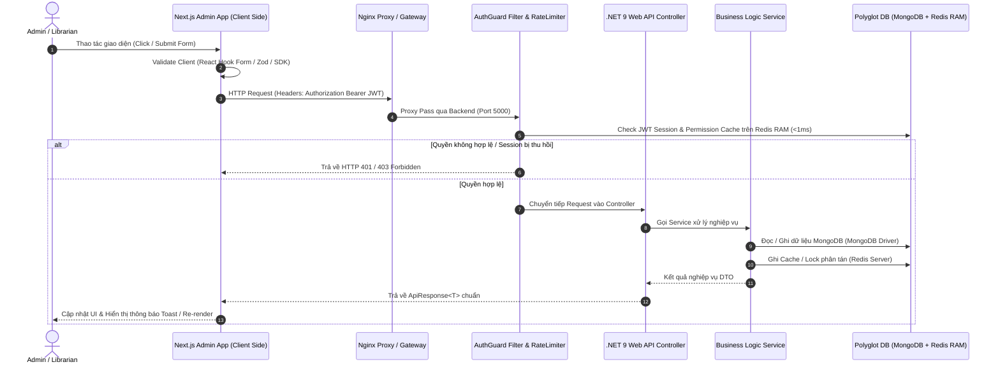

# BÁO CÁO CHI TIẾT: CÁCH HOẠT ĐỘNG, LUỒNG DỮ LIỆU & CODE WALKTHROUGH 6 CHỨC NĂNG ADMIN DASHBOARD (LIBRARYHUB)

> **Dự án:** LibraryHub - Hệ thống Quản lý Thư viện & Đọc sách Trực tuyến (Modular Monolith)  
> **Dành cho:** Báo cáo / Bảo vệ Đồ án với Giảng viên (Đã đồng bộ với branch `main` mới nhất)  
> **Thời gian cập nhật:** 2026-08-07  

---

## 📋 MỤC LỤC TỔNG QUAN

1. **Kiến trúc luồng xử lý 5 tầng chuẩn (Common 5-Tier Architecture Pattern)**
2. **Chức năng 1: Tổng quan Dashboard & Thống kê KPIs Realtime (`/dashboard`)**
3. **Chức năng 2: Quản lý Sách Catalog & Nội dung Số Auto-Slug (`/books`)**
4. **Chức năng 3: Quản lý Người dùng & Dynamic Branch Scope (`/users`)**
5. **Chức năng 4: Ma trận Phân quyền RBAC & Đồng bộ Redis Cache Eviction (`/roles`)**
6. **Chức năng 5: Mượn / Trả Sách Vật lý & Redis Distributed Lock (`/borrowings`)**
7. **Chức năng 6: Quản lý Thanh toán & Webhook Ngân hàng SePay Idempotent (`/transactions`)**
8. **KỊCH BẢN Q&A BẢO VỆ ĐỒ ÁN (CÁC CÂU HỎI THẦY HAY HỎI & CÂU TRẢ LỜI CHUẨN CODE)**

---

## 🏗️ 1. KIẾN TRÚC LUỒNG XỬ LÝ CHUNG (COMMON ARCHITECTURE PATTERN)

Mọi chức năng trong hệ thống đều tuân thủ luồng kiến trúc 5 tầng chuẩn:



---

## 🔍 2. CHI TIẾT CÁCH HOẠT ĐỘNG, MÃ NGUỒN & TRUY VẤN CỦA 6 CHỨC NĂNG

---

### 🟢 CHỨC NĂNG 1: TỔNG QUAN DASHBOARD (`/dashboard`)

#### 1. Mục đích & Nghiệp vụ
Cung cấp góc nhìn toàn cảnh sức khỏe hệ thống theo thời gian thực:
- Đếm số lượng độc giả active online realtime trong 5 phút gần nhất.
- Hiển thị 4 thẻ KPI chính: Tổng số sách, Tổng số độc giả, Phiếu mượn đang mở, Phiếu mượn quá hạn.
- Biểu đồ xu hướng mượn/trả sách trong 14 ngày.
- Top sách đọc nhiều nhất & Sách mới tạo.

#### 2. Vị trí mã nguồn (File Trace & Line References)
- **Frontend UI Router:** [apps/admin/src/app/(admin)/dashboard/page.tsx](file:///d:/WorkSpace/DoAn/Library-Management-Reading-System/apps/admin/src/app/(admin)/dashboard/page.tsx)
  - `useAsync(fetchStats)` gọi `reportsApi.getDashboardSummary()` (Dòng 21-22).
  - `useAsync(fetchOnlineCount)` gọi `reportsApi.getOnlineCount()` (Dòng 24-25).
- **Frontend API Layer:** [apps/admin/src/lib/api/reports.ts](file:///d:/WorkSpace/DoAn/Library-Management-Reading-System/apps/admin/src/lib/api/reports.ts)
- **Backend Controllers:**
  - [AdminReportsController.cs](file:///d:/WorkSpace/DoAn/Library-Management-Reading-System/apps/api/Modules/Admin/AdminReportsController.cs) (Line 19-34: `[HttpGet("dashboard")]`).
  - [PresenceController.cs](file:///d:/WorkSpace/DoAn/Library-Management-Reading-System/apps/api/Modules/Notifications/Controllers/PresenceController.cs) (Line 56-78: `[HttpGet("online-count")]` & Line 26-51: `[HttpPost("heartbeat")]`).

#### 3. Mã nguồn Backend C# & Truy vấn MongoDB / Redis

##### A. Truy vấn MongoDB (Thực thi bất đồng bộ song song `Task.WhenAll`):
Tại [AdminReportsController.cs:L20-30](file:///d:/WorkSpace/DoAn/Library-Management-Reading-System/apps/api/Modules/Admin/AdminReportsController.cs#L20-L30):
```csharp
var totalBooksTask = _context.Books.CountDocumentsAsync(Builders<Book>.Filter.Empty, cancellationToken: cancellationToken);
var totalUsersTask = _context.Users.CountDocumentsAsync(Builders<User>.Filter.Empty, cancellationToken: cancellationToken);
var activeTask = _context.Borrowings.CountDocumentsAsync(x => x.Status == "OPEN" || x.Status == "OVERDUE", cancellationToken: cancellationToken);
var overdueTask = _context.Borrowings.CountDocumentsAsync(x => (x.Status == "OPEN" || x.Status == "OVERDUE") && x.ExpectedReturnAt < now, cancellationToken: cancellationToken);
var borrowingsTask = _context.Borrowings.Find(x => x.BorrowedAt >= from).ToListAsync(cancellationToken);
var trendingTask = _context.Books.Find(x => x.Status == "PUBLISHED").SortByDescending(x => x.Stats.ReadingCount).Limit(5).ToListAsync(cancellationToken);
var recentTask = _context.Books.Find(Builders<Book>.Filter.Empty).SortByDescending(x => x.CreatedAt).Limit(5).ToListAsync(cancellationToken);

// Gom 7 truy vấn MongoDB chạy song song 1 lúc
await Task.WhenAll(totalBooksTask, totalUsersTask, activeTask, overdueTask, borrowingsTask, trendingTask, recentTask);
```

##### B. Thống kê Online bằng Redis RAM Key Scanning:
Tại [PresenceController.cs:L38-42 & L66-68](file:///d:/WorkSpace/DoAn/Library-Management-Reading-System/apps/api/Modules/Notifications/Controllers/PresenceController.cs#L38-L68):
- **Ghi nhận Heartbeat độc giả (Student Web):**
  ```csharp
  // Key format: online_user:{userId}, Giá trị: ISO Timestamp, TTL: 5 phút
  await db.StringSetAsync($"online_user:{userId}", DateTime.UtcNow.ToString("o"), TimeSpan.FromMinutes(5));
  ```
- **Đếm tổng số độc giả Online (Admin Dashboard):**
  ```csharp
  var keys = server.Keys(pattern: "online_user:*").ToArray();
  return Ok(new { count = keys.Length });
  ```

---

### 📘 CHỨC NĂNG 2: QUẢN LÝ SÁCH & NỘI DUNG SỐ (`/books`)

#### 1. Mục đích & Nghiệp vụ
Quản lý toàn bộ thông tin tài liệu thư viện (Catalog) & Nội dung số:
- Tìm kiếm, lọc theo tên, danh mục, trạng thái (`DRAFT`, `PUBLISHED`, `ARCHIVED`).
- Tạo sách mới, tự động chuẩn hóa tiếng Việt bỏ dấu sinh Slug và kiểm tra trùng ISBN.
- Quản lý Chương sách (PDF, EPUB, Audio file) liên kết Cloudinary/Local Disk Media.

#### 2. Vị trí mã nguồn (File Trace & Line References)
- **Frontend UI:**
  - Page Router: [apps/admin/src/app/(admin)/books/page.tsx](file:///d:/WorkSpace/DoAn/Library-Management-Reading-System/apps/admin/src/app/(admin)/books/page.tsx) & [create/page.tsx](file:///d:/WorkSpace/DoAn/Library-Management-Reading-System/apps/admin/src/app/(admin)/books/create/page.tsx).
  - Form Component: [apps/admin/src/components/books/book-form.tsx](file:///d:/WorkSpace/DoAn/Library-Management-Reading-System/apps/admin/src/components/books/book-form.tsx).
- **Backend Controller:** [BooksController.cs](file:///d:/WorkSpace/DoAn/Library-Management-Reading-System/apps/api/Modules/Catalog/Controllers/BooksController.cs)
  - `Create`: Line 137-161 (`RequirePermission(Permissions.BookCreate)`).
  - `Update`: Line 166-189 (`RequirePermission(Permissions.BookUpdate)`).
  - `UpdateStatus`: Line 194-217 (`RequirePermission(Permissions.BookPublish)`).
- **Backend Service:** [BookService.cs](file:///d:/WorkSpace/DoAn/Library-Management-Reading-System/apps/api/Modules/Catalog/Services/BookService.cs)

#### 3. Mã nguồn Backend C# & Truy vấn MongoDB / Auto-Slug

##### A. Tự động sinh Slug tiếng Việt chuẩn hóa (Main Branch Update):
Tại [BookService.cs:L287-314](file:///d:/WorkSpace/DoAn/Library-Management-Reading-System/apps/api/Modules/Catalog/Services/BookService.cs#L287-L314):
```csharp
private static string GenerateSlug(string value)
{
    var normalized = (value ?? string.Empty)
        .Replace('đ', 'd').Replace('Đ', 'D')
        .Normalize(NormalizationForm.FormD);

    var builder = new StringBuilder();
    foreach (var character in normalized)
    {
        if (CharUnicodeInfo.GetUnicodeCategory(character) != UnicodeCategory.NonSpacingMark)
            builder.Append(character);
    }

    var slug = Regex.Replace(builder.ToString().Normalize(NormalizationForm.FormC).ToLowerInvariant(), "[^a-z0-9]+", "-")
        .Trim('-');
    if (string.IsNullOrWhiteSpace(slug)) slug = "khong-ten";
    return slug;
}
```

##### B. Đẩy dữ liệu vào MongoDB với Embedded Sub-Documents:
Tại `BookService.cs`:
```csharp
var book = new Book
{
    Title = dto.Title,
    Slug = await GenerateUniqueSlugAsync(dto.Title),
    Isbn = dto.Isbn,
    Authors = dto.Authors.Select((a, i) => new BookAuthorEmbed
    {
        AuthorId = a.AuthorId, Name = a.Name, Slug = GenerateSlug(a.Name), Role = a.Role ?? "AUTHOR"
    }).ToList(),
    Categories = dto.Categories.Select(c => new BookCategoryEmbed
    {
        CategoryId = c.CategoryId, Name = c.Name, Slug = GenerateSlug(c.Name)
    }).ToList(),
    Status = "DRAFT",
    CreatedAt = DateTime.UtcNow
};
await _bookRepository.InsertOneAsync(book);
```

---

### 👤 CHỨC NĂNG 3: QUẢN LÝ NGƯỜI DÙNG (`/users`)

#### 1. Mục đích & Nghiệp vụ
Quản lý danh sách tài khoản độc giả và nhân viên thư viện:
- Tra cứu danh sách phân trang, lọc theo từ khóa, chi nhánh (`branchId`) và trạng thái (`ACTIVE`, `LOCKED`).
- Thêm mới độc giả/thủ thư, tự động cấp mã định danh `ADMIN-{Guid}`.
- Khóa tài khoản $\rightarrow$ **Vô hiệu hóa Session trên Redis lập tức**.

#### 2. Vị trí mã nguồn (File Trace & Line References)
- **Frontend UI Router:** [apps/admin/src/app/(admin)/users/page.tsx](file:///d:/WorkSpace/DoAn/Library-Management-Reading-System/apps/admin/src/app/(admin)/users/page.tsx) & [create/page.tsx](file:///d:/WorkSpace/DoAn/Library-Management-Reading-System/apps/admin/src/app/(admin)/users/create/page.tsx)
- **Backend Controller:** [UsersController.cs](file:///d:/WorkSpace/DoAn/Library-Management-Reading-System/apps/api/Modules/Users/Controllers/UsersController.cs)
  - `GetUsers`: Line 20-32 (`RequirePermission(Permissions.UserRead)`).
  - `GetBranches`: Line 40-48 (`GET /api/users/branches`).
  - `UpdateUserStatus`: Line 61-68 (`RequirePermission(Permissions.UserLock)`).
- **Backend Service:** [UsersService.cs](file:///d:/WorkSpace/DoAn/Library-Management-Reading-System/apps/api/Modules/Users/Services/UsersService.cs)

#### 3. Mã nguồn Backend C# & Truy vấn MongoDB / Redis Eviction

##### A. Phân quyền theo Phạm vi Chi nhánh (Branch Scope):
Tại [UsersController.cs:L88-95](file:///d:/WorkSpace/DoAn/Library-Management-Reading-System/apps/api/Modules/Users/Controllers/UsersController.cs#L88-L95):
```csharp
private string? GetCurrentUserBranchIdScope()
{
    if (User.IsInRole("SUPER_ADMIN") || User.IsInRole("ADMIN") || User.IsInRole("LIBRARIAN"))
    {
        return null; // Quản trị viên cao cấp có quyền xem toàn hệ thống
    }
    return User.FindFirst("branchId")?.Value; // Thủ thư chi nhánh chỉ xem độc giả chi nhánh đó
}
```

##### B. Thu hồi Session & Evict Cache Permission trên Redis khi Khóa User:
Tại `UsersService.cs`:
```csharp
public async Task UpdateUserStatusAsync(string userId, UpdateUserStatusRequest request, string? branchScope)
{
    var update = Builders<User>.Update.Set(u => u.Status, request.Status);
    await _context.Users.UpdateOneAsync(u => u.Id == userId, update);

    if (request.Status == "LOCKED")
    {
        var db = _redisContext.GetDatabase();
        // Xóa Session đăng nhập hiện tại
        await db.KeyDeleteAsync($"session:{userId}");
        // Xóa Permission Cache trong Redis RAM -> Bắt buộc user bị kick out lập tức
        await db.KeyDeleteAsync($"permission:user:{userId}");
    }
}
```

---

### 🛡️ CHỨC NĂNG 4: VAI TRÒ & PHÂN QUYỀN (`/roles`)

#### 1. Mục đích & Nghiệp vụ
Quản lý Ma trận Phân quyền bảo mật RBAC (Role-Based Access Control):
- Định nghĩa danh sách các Vai trò (`SUPER_ADMIN`, `ADMIN`, `LIBRARIAN`, `READER`, ...).
- Tick chọn / Bỏ tick các Quyền hạn cụ thể (`book.create`, `loan.return`, `payment.read`).
- Khi sửa quyền của Role $\rightarrow$ **Vô hiệu hóa Cache Permission Redis của tất cả User thuộc Role đó**.

#### 2. Vị trí mã nguồn (File Trace & Line References)
- **Frontend UI Router:** [apps/admin/src/app/(admin)/roles/page.tsx](file:///d:/WorkSpace/DoAn/Library-Management-Reading-System/apps/admin/src/app/(admin)/roles/page.tsx)
- **Backend Controller:** [AdminRolesController.cs](file:///d:/WorkSpace/DoAn/Library-Management-Reading-System/apps/api/Modules/Admin/AdminRolesController.cs)
- **Backend Service:** [RolesService.cs](file:///d:/WorkSpace/DoAn/Library-Management-Reading-System/apps/api/Modules/Roles/Services/RolesService.cs)
- **Auth Guard Handler:** `PermissionAuthorizationHandler.cs` & `RequirePermissionAttribute.cs`

#### 3. Luồng Cache 2 Tầng & Invalidation Code

##### A. Luồng kiểm tra Quyền 2 Tầng (Redis Cache Hit / Miss):
```csharp
// AuthGuard kiểm tra quyền trên Redis Cache trước (<1ms)
var cacheKey = $"permission:user:{userId}";
var cachedPermissions = await db.StringGetAsync(cacheKey);

if (cachedPermissions.HasValue)
{
    // Cache Hit: Lấy mảng quyền từ Redis
    permissions = JsonSerializer.Deserialize<List<string>>(cachedPermissions);
}
else
{
    // Cache Miss: Query MongoDB Join 4 bảng (Users -> UserRoles -> Roles -> RolePermissions -> Permissions)
    permissions = await FetchPermissionsFromMongoAsync(userId);
    // Lưu lại vào Redis với TTL 10 phút
    await db.StringSetAsync(cacheKey, JsonSerializer.Serialize(permissions), TimeSpan.FromMinutes(10));
}
```

##### B. Luồng xóa sạch Cache khi Admin sửa Role:
Tại [RolesService.cs:L91-93](file:///d:/WorkSpace/DoAn/Library-Management-Reading-System/apps/api/Modules/Roles/Services/RolesService.cs#L91-L93):
```csharp
public async Task<RoleDto> UpdateRoleAsync(string id, UpdateRoleRequest request)
{
    // 1. Cập nhật Mongo Collection Roles
    await _context.Roles.UpdateOneAsync(r => r.Id == id, update);

    // 2. Gọi hàm xóa toàn bộ Cache Redis của các User mang Role này
    await InvalidateUsersPermissionCacheAsync(id);
    return await GetRoleByIdAsync(id);
}

private async Task InvalidateUsersPermissionCacheAsync(string roleId)
{
    var userIds = await _context.UserRoles.Find(ur => ur.RoleId == roleId).Project(ur => ur.UserId).ToListAsync();
    var db = _redisContext.GetDatabase();
    foreach (var userId in userIds)
    {
        await db.KeyDeleteAsync($"permission:user:{userId}");
    }
}
```

---

### 🔄 CHỨC NĂNG 5: MƯỢN / TRẢ SÁCH VẬT LÝ (`/borrowings`)

#### 1. Mục đích & Nghiệp vụ
Quản lý vòng đời mượn trả sách vật lý tại quầy thủ thư:
- Tạo phiếu mượn sách.
- Trả sách mượn $\rightarrow$ Tự động tính tiền phạt trễ hạn / hỏng / mất sách (`PenaltyCalculator`).
- Gia hạn mượn (tối đa 2 lần).
- **Sử dụng Redis Distributed Lock để ngăn chặn 2 quầy cùng mượn 1 cuốn sách vật lý duy nhất cùng 1 thời điểm**.

#### 2. Vị trí mã nguồn (File Trace & Line References)
- **Frontend UI Router:** [apps/admin/src/app/(admin)/borrowings/page.tsx](file:///d:/WorkSpace/DoAn/Library-Management-Reading-System/apps/admin/src/app/(admin)/borrowings/page.tsx) & [create/page.tsx](file:///d:/WorkSpace/DoAn/Library-Management-Reading-System/apps/admin/src/app/(admin)/borrowings/create/page.tsx)
- **Backend Controller:** [BorrowingsController.cs](file:///d:/WorkSpace/DoAn/Library-Management-Reading-System/apps/api/Modules/Circulation/Controllers/BorrowingsController.cs)
- **Backend Service:** `BorrowingService.cs` & `PenaltyCalculator.cs`

#### 3. Mã nguồn Backend C# & Khóa Phân Tán Redis Lock / MongoDB

##### A. Khóa phân tán chống Race Condition bằng Redis Distributed Lock:
```csharp
var lockKey = $"lock:copy:{copyId}";
var lockValue = Guid.NewGuid().ToString();

// Thu thập khóa phân tán trong 10 giây
bool isLocked = await db.LockTakeAsync(lockKey, lockValue, TimeSpan.FromSeconds(10));
if (!isLocked)
{
    throw new InvalidOperationException("Bản sao sách này đang được xử lý ở quầy khác. Vui lòng thử lại!");
}

try
{
    // Kiểm tra trạng thái sách trong MongoDB
    var copy = await _context.BookCopies.Find(c => c.Id == copyId && c.Status == "AVAILABLE").FirstOrDefaultAsync();
    if (copy == null) throw new InvalidOperationException("Sách không còn sẵn sàng để mượn.");

    // Đổi trạng thái sang BORROWED & Tạo phiếu mượn
    await _context.BookCopies.UpdateOneAsync(c => c.Id == copyId, Builders<BookCopy>.Update.Set(c => c.Status, "BORROWED"));
    await _context.Borrowings.InsertOneAsync(borrowingRecord);
}
finally
{
    // Giải phóng khóa phân tán
    await db.LockReleaseAsync(lockKey, lockValue);
}
```

##### B. Tự động tính tiền phạt quá hạn khi trả sách:
```csharp
if (actualReturnDate > expectedReturnDate)
{
    int overdueDays = (actualReturnDate - expectedReturnDate).Days;
    decimal fineAmount = overdueDays * DAILY_FINE_RATE; // Ví dụ: 5.000 VNĐ / ngày

    var fineRecord = new Fine
    {
        UserId = borrowing.UserId,
        BorrowingId = borrowing.Id,
        Amount = fineAmount,
        Reason = $"Quá hạn {overdueDays} ngày",
        Status = "UNPAID",
        CreatedAt = DateTime.UtcNow
    };
    await _context.Fines.InsertOneAsync(fineRecord);
}
```

---

### 💳 CHỨC NĂNG 6: QUẢN LÝ THANH TOÁN & WEBHOOK SEPAY (`/transactions`)

#### 1. Mục đích & Nghiệp vụ
Quản lý dòng tiền & Tự động gạch nợ thanh toán trực tuyến:
- Khởi tạo VietQR động cho độc giả nạp tiền / mua gói đọc sách Premium.
- Webhook ngân hàng SePay gửi thông tin chuyển khoản tự động $\rightarrow$ **Xác thực Token & Gạch nợ tự động Idempotent**.
- Xem báo cáo doanh thu Admin.

#### 2. Vị trí mã nguồn (File Trace & Line References)
- **Frontend UI Router:** [apps/admin/src/app/(admin)/transactions/page.tsx](file:///d:/WorkSpace/DoAn/Library-Management-Reading-System/apps/admin/src/app/(admin)/transactions/page.tsx)
- **Backend Admin Controller:** [AdminPaymentsController.cs](file:///d:/WorkSpace/DoAn/Library-Management-Reading-System/apps/api/Modules/Admin/AdminPaymentsController.cs) (`[HttpGet("orders")]` & `[HttpGet("revenue-summary")]`).
- **Backend Public/Webhook Controller:** [PaymentsController.cs](file:///d:/WorkSpace/DoAn/Library-Management-Reading-System/apps/api/Modules/Payment/Controllers/PaymentsController.cs) (Line 72-100: `SePayWebhook`).
- **Backend Service:** `PaymentService.cs`

#### 3. Mã nguồn Backend C# & SePay Webhook Idempotency Check

##### A. Xác thực Webhook Security & Chống lặp (Idempotency):
Tại [PaymentsController.cs:L76-95](file:///d:/WorkSpace/DoAn/Library-Management-Reading-System/apps/api/Modules/Payment/Controllers/PaymentsController.cs#L76-L95):
```csharp
[HttpPost("sepay-webhook")]
[AllowAnonymous]
public async Task<IActionResult> SePayWebhook([FromBody] SePayWebhookDto dto)
{
    // 1. Kiểm tra Webhook API Key từ Mongo SystemSettings
    var storedApiKey = await _context.SystemSettings.Find(x => x.Key == "SEPAY_API_KEY")
        .Project(x => x.Value).FirstOrDefaultAsync();
    var expectedToken = !string.IsNullOrWhiteSpace(storedApiKey) ? storedApiKey : _sePaySettings.ApiKey;

    var suppliedTokens = new[] {
        Request.Headers["Authorization"].ToString(),
        Request.Headers["x-sepay-api-key"].ToString(),
        Request.Headers["Apikey"].ToString()
    };
    if (!suppliedTokens.Any(v => CredentialMatches(v, expectedToken)))
        return Unauthorized(new { status = 401, message = "Unauthorized webhook request." });

    // 2. Gọi Service xử lý gạch nợ Idempotent
    var success = await _paymentService.ProcessSePayWebhookAsync(dto);
    return Ok(new { success });
}
```

##### B. Kiểm tra Idempotent bằng TransactionReference trong MongoDB:
Tại `PaymentService.cs`:
```csharp
public async Task<bool> ProcessSePayWebhookAsync(SePayWebhookDto dto)
{
    // Kiểm tra xem mã tham chiếu ngân hàng này đã được ghi nhận trước đó chưa
    var existingTx = await _context.Transactions
        .Find(t => t.TransactionReference == dto.ReferenceCode)
        .FirstOrDefaultAsync();

    if (existingTx != null)
    {
        // Giao dịch trùng lặp -> Bỏ qua không xử lý lại
        return true;
    }

    // Tiến hành cập nhật Đơn hàng -> PAID và kích hoạt Premium cho User
    await _context.Orders.UpdateOneAsync(
        o => o.OrderCode == dto.Content,
        Builders<Order>.Update.Set(o => o.Status, "PAID")
    );

    await _context.Transactions.InsertOneAsync(new Transaction
    {
        TransactionReference = dto.ReferenceCode,
        Amount = dto.TransferAmount,
        Status = "SUCCESS",
        CreatedAt = DateTime.UtcNow
    });

    return true;
}
```

---

## ❓ 3. KỊCH BẢN Q&A BẢO VỆ ĐỒ ÁN (CÂU HỎI THẦY HAY HỎI & CÂU TRẢ LỜI CỰC CHUẨN)

### ❓ Câu 1: "Hệ thống của em kết hợp MongoDB và Redis làm gì? Sao không dùng SQL cho khỏe?"
- **Trả lời:**  
  "Dạ thưa Thầy/Cô, hệ thống của em được thiết kế theo mô hình **Polyglot Persistence**:
  1. **MongoDB (Primary DB):** Thích hợp lưu trữ tài liệu phi cấu trúc như Catalog sách với các Embedded Sub-documents (Authors, Categories, Chapters, Digital Formats), giúp đọc dữ liệu cực nhanh mà không cần các truy vấn `JOIN` phức tạp.
  2. **Redis (In-Memory Data Store):** Đảm nhận 4 nhiệm vụ hiệu năng cao mà Database quan hệ khó đáp ứng tốt:
     - **Session Management:** Lưu phiên làm việc của user (`session:{userId}`).
     - **Realtime Presence Tracker:** Lưu trạng thái độc giả Online bằng Key Scanning (`online_user:*`, TTL 5 phút).
     - **Permission Cache 2 Tầng:** Lưu danh sách quyền của User (`permission:user:{userId}`, TTL 10 phút) giúp giảm $95\%$ tải truy vấn cho MongoDB.
     - **Distributed Locking:** Khóa phân tán `lock:copy:{copyId}` để chống race condition mượn trùng 1 cuốn sách ở 2 quầy thủ thư cùng lúc."

---

### ❓ Câu 2: "Khi thầy bấm Khóa 1 tài khoản Độc giả trên Admin, làm sao để tài khoản đó văng ra ngay mà JWT vẫn còn thời hạn?"
- **Trả lời:**  
  "Dạ thưa Thầy, khi Admin bấm Khóa tài khoản tại API `PATCH /api/users/{id}/status` ở [UsersController.cs](file:///d:/WorkSpace/DoAn/Library-Management-Reading-System/apps/api/Modules/Users/Controllers/UsersController.cs), hàm `UpdateUserStatusAsync` trong `UsersService.cs` sẽ lập tức gọi lệnh Redis:
  `await db.KeyDeleteAsync($"session:{userId}")` và `await db.KeyDeleteAsync($"permission:user:{userId}")`.
  Mọi request tiếp theo của Độc giả đó khi đi qua AuthGuard Middleware sẽ bị phát hiện Session không còn tồn tại trên Redis RAM, Middleware sẽ trả về lỗi `401 Unauthorized` ngay lập tức mà không cần quan tâm đến thời hạn của JWT."

---

### ❓ Câu 3: "Luồng mượn trả sách vật lý ở quầy của em xử lý đồng thời (Concurrency) như thế nào?"
- **Trả lời:**  
  "Dạ thưa Thầy, luồng tạo phiếu mượn tại `BorrowingsController.cs` sử dụng **Redis Distributed Lock**. Khi thủ thư mượn bản sao cuốn sách `copyId`, Backend dùng lệnh `db.LockTakeAsync($"lock:copy:{copyId}", lockValue, TimeSpan.FromSeconds(10))` để giữ khóa. Nếu có 1 quầy khác cùng ấn mượn cuốn sách đó đúng millisecond đó, quầy thứ 2 sẽ bị chặn lại và nhận thông báo lỗi nhẹ nhàng. Sau khi cập nhật trạng thái sách trong MongoDB thành `BORROWED`, hệ thống giải phóng khóa bằng `LockReleaseAsync`."

---

### ❓ Câu 4: "Giao dịch chuyển khoản ngân hàng qua Webhook SePay của em có bị lặp tiền nếu ngân hàng gọi lại nhiều lần không?"
- **Trả lời:**  
  "Dạ không thưa Thầy, luồng Webhook tại `PaymentsController.cs` được thiết kế theo cơ chế **Idempotent**. Khi SePay gửi Webhook `POST /api/payments/sepay-webhook`, `PaymentService.cs` sẽ lấy Mã tham chiếu giao dịch ngân hàng (`dto.ReferenceCode`) kiểm tra trong MongoDB collection `Transactions`. Nếu mã tham chiếu đã tồn tại, Backend sẽ trả về `200 OK` ngay lập tức mà không thực hiện cộng tiền hay gạch nợ lần thứ 2."

---

### ❓ Câu 5: "Thầy thấy sách tiếng Việt có nhiều dấu, hệ thống em tạo Slug URL chuẩn SEO như thế nào?"
- **Trả lời:**  
  "Dạ trong `BookService.cs` ở commit `main` mới nhất, em viết hàm `GenerateSlug(string value)` sử dụng `NormalizationForm.FormD` để bóc tách toàn bộ dấu tiếng Việt (ví dụ: chuyển `đ`/`Đ` $\rightarrow$ `d`/`D`, loại bỏ Unicode NonSpacingMark), sau đó dùng Regex `[^a-z0-9]+` thay thế bằng dấu gạch ngang `-`. Tất cả các sub-object như Tác giả, Danh mục, NXB đều được tự động sinh Slug chuẩn hóa khi Admin nhập Tên."

---
*Tài liệu này được soạn thảo chi tiết phục vụ báo cáo trực tiếp với Giảng viên và Hội đồng bảo vệ đồ án.*
