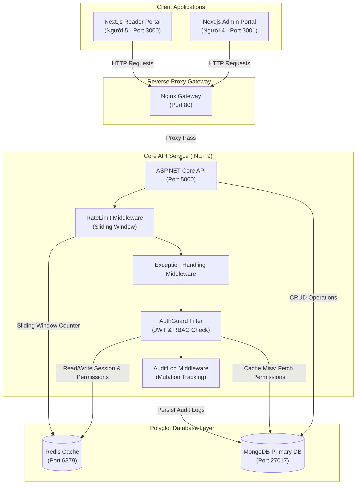
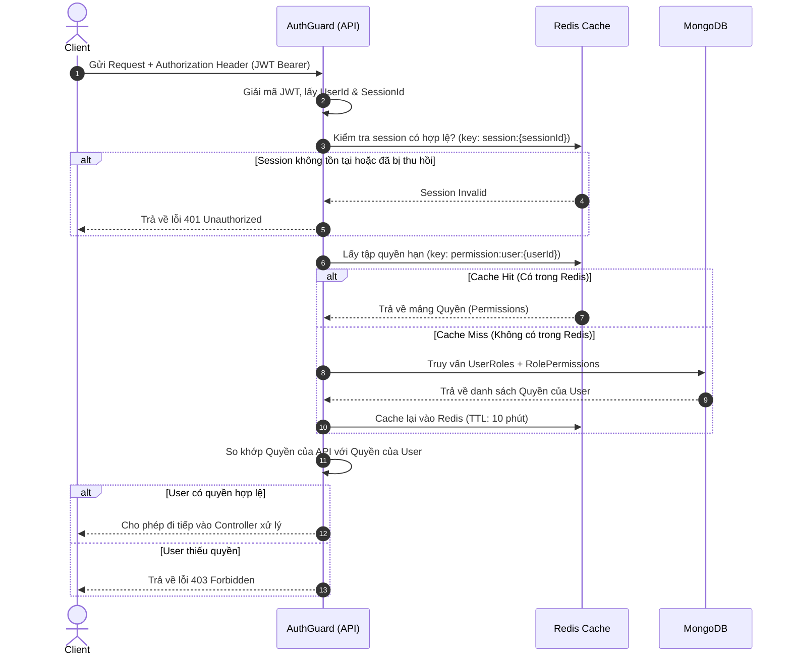

# Sơ đồ Kiến trúc Hệ thống (System Architecture Diagram)

Tài liệu này mô tả sơ đồ kiến trúc tổng thể của dự án **LibraryHub (Hệ thống Quản lý Thư viện và Đọc sách Online)** do **Người 1 (Tech Lead)** xây dựng, phục vụ cho việc tích hợp và bàn giao cho các thành viên trong nhóm.

---

## 1. Sơ đồ Kiến trúc Tổng thể (System Overview)

Dưới đây là sơ đồ tương tác giữa Client (Next.js Apps), Reverse Proxy (Nginx), Backend (ASP.NET Core API) và Database Layer (MongoDB & Redis).

---

## 2. Luồng Dữ liệu Phân Quyền (RBAC Flow with Cache)

Hệ thống sử dụng cơ chế **Polyglot Persistence** kết hợp giữa MongoDB (lưu trữ lâu dài) và Redis (cache hiệu năng cao) để tối ưu hóa việc phân quyền:

---

## 3. Quy tắc lưu trữ Dữ liệu (Storage Strategy)

| Dữ liệu | Database chính | Cơ chế bổ trợ / Cache | Lý do chọn |
| :--- | :--- | :--- | :--- |
| **Tài khoản, Vai trò, Quyền hạn** | MongoDB | Cache danh sách quyền trên Redis | Truy vấn nhiều, ít thay đổi. Cần tốc độ đọc cao. |
| **Phiên làm việc (Auth Session)** | Redis | Lưu bản phụ ở MongoDB | Đăng xuất từ xa cần kiểm tra nhanh. Hết hạn tự hủy (TTL). |
| **Thông tin sách, chương** | MongoDB | Không (hoặc CDN ảnh bìa) | Tài liệu lớn (chương sách dài), tìm kiếm text search. |
| **Tiến trình đọc (Reading Progress)** | MongoDB | Lưu tạm thời trên Redis | Sinh viên cuộn trang liên tục (ghi dữ liệu tần suất cực cao). Lưu tạm trên Redis rồi sync định kỳ giúp tránh nghẽn MongoDB. |
| **Sách xu hướng (Trending)** | Redis Sorted Set | Sync thống kê sang MongoDB | Cần tính điểm lượt đọc/lượt mở trong ngày thời gian thực. Redis Sorted Set xử lý bảng xếp hạng cực tốt. |
| **Nhật ký hệ thống (Audit Log)** | MongoDB | Không | Dữ liệu ghi một lần (Write-once), chỉ đọc khi kiểm toán, không cần cache. |
